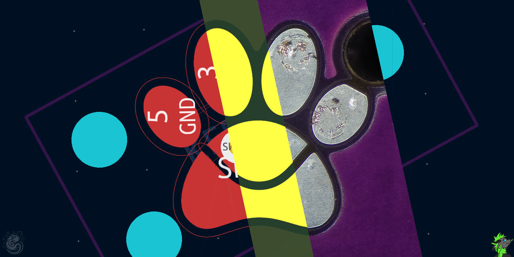
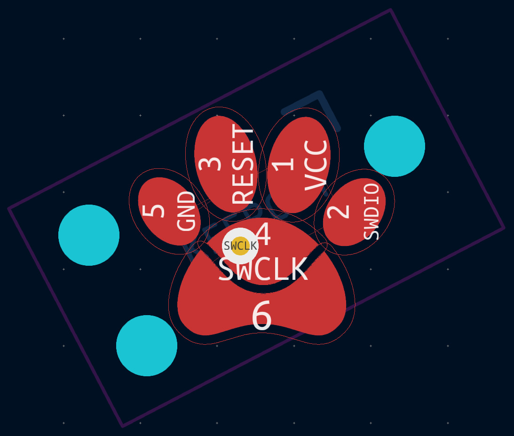
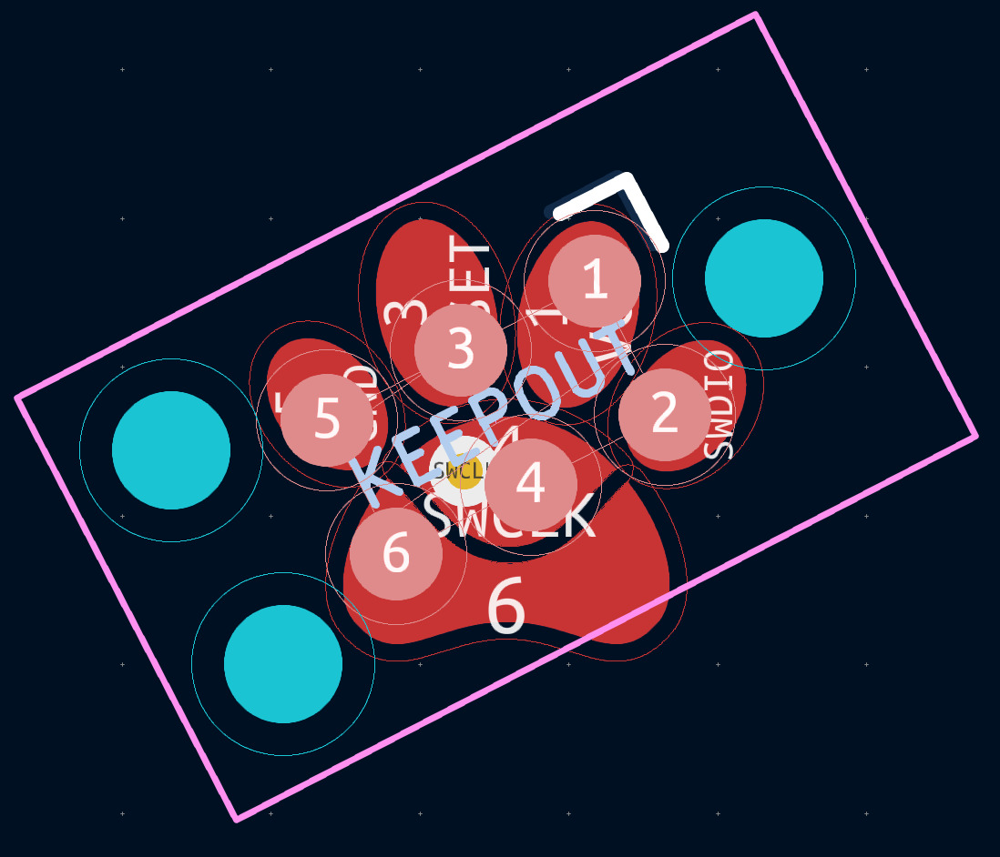
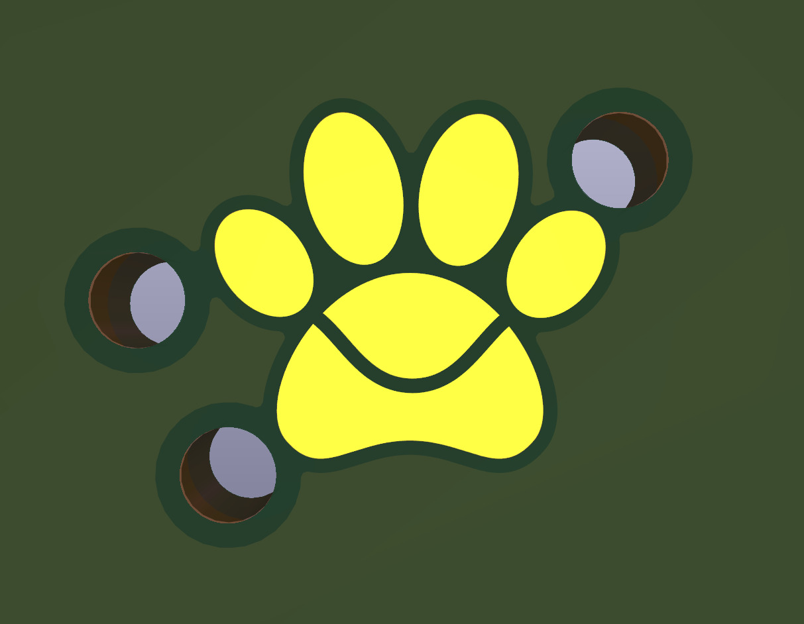
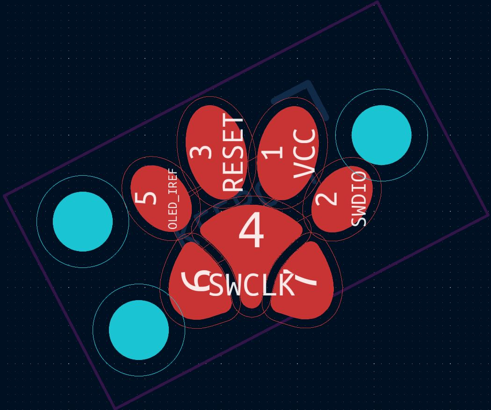
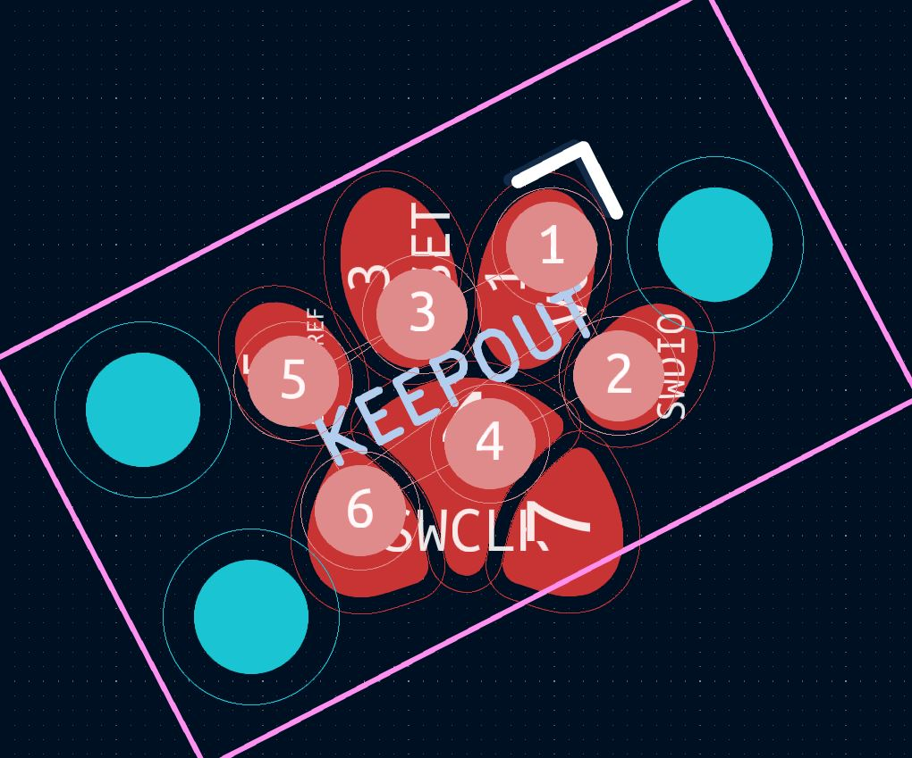
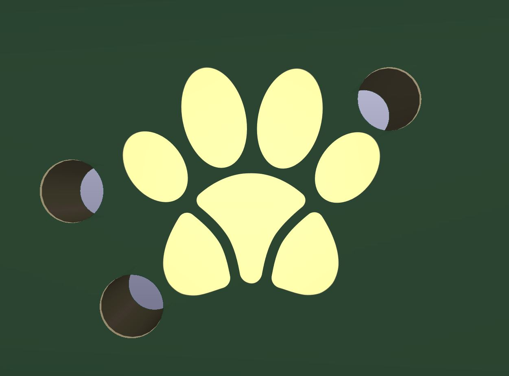
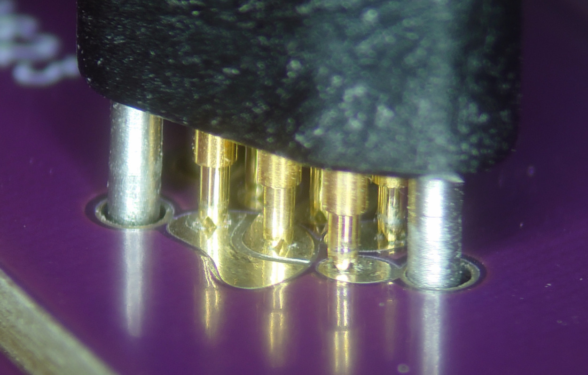
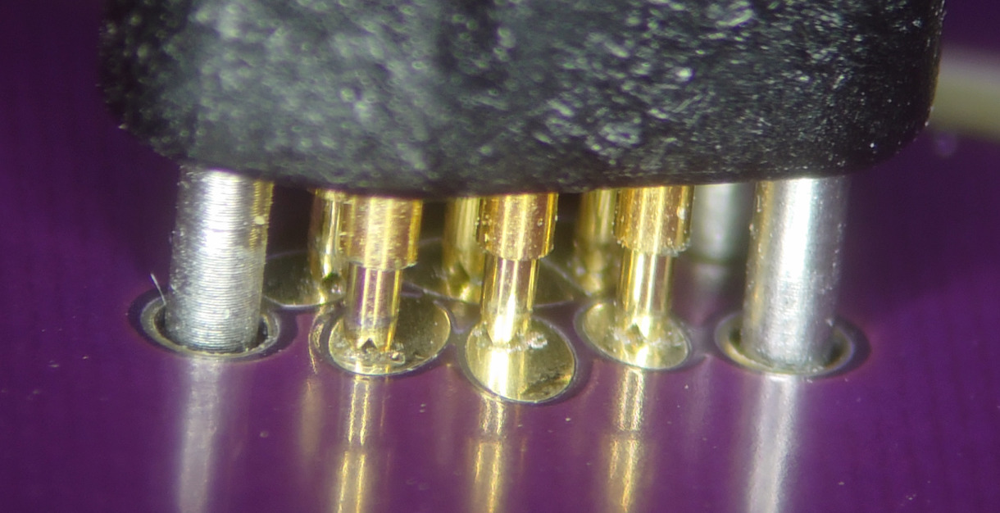
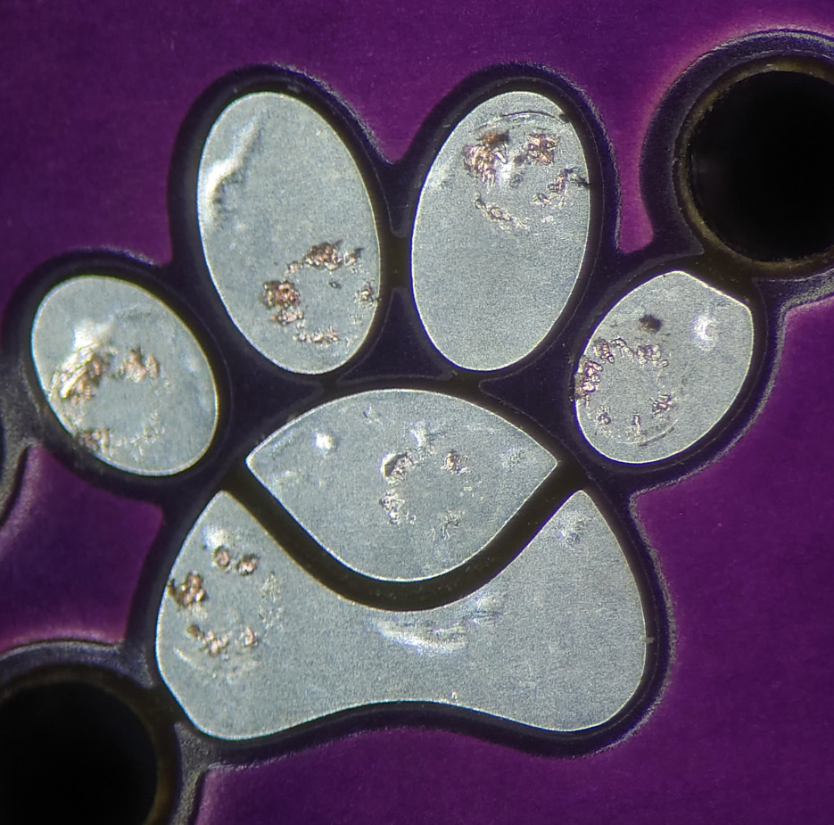

# Paw-Connect TC2030
An alternative KiCad PCB ~~foot~~ pawprint for the TC2030 pogo pin programming cable in the shape of a cute little paw.

## Features
### Pros
- No need to build your own pogo-pin jig. It's simply compatible with the Tag-Connect TC2030-*-NL pogo pin programming cable.
- **Pawsitively Purrfect Aesthetics:** Stand out from traditional PCB footprints with this eye-catching and playful paw-shaped design. Add a touch of personality and creativity to your PCB layout.
- **Easy Spotting for the Pawssionate:** Quickly locate the programming cable connection on your PCB with this unmistakable pawprint. No more searching around or mistaking it for a regular boring connector.
- **Compact Cuteness:** This pawprint is designed to be compact, allowing you to fit it into tight spaces while still showcasing your pawfect style. Designed for an optimized paw fill factor, it maximizes space utilization on your PCB while delivering a delightful aesthetic. It's the perfect balance of compactness and adorable paw presence, proving that good things do come in small paws.
- **Clawsome Integration::** This pawprint can be easily integrated into existing PCB layouts without requiring significant modifications.
- **Meowgnificent Versatility:** Suitable for a wide range of applications, from small-scale projects to larger circuits, this pawprint adds a touch of beans to any design.
- Paws! 🐾

### Cons
- Pin 4 is pretty impossible to fan out without a via in rev. A, which might compromise the aesthetic / durability a bit
    - Best to place the via a bit to the left, so it's further away from the landing pin
- Not optimized for manufacturers with high tolerances
- **Pawsome Distraction:** Paws are undeniably attention grabbing, but what if your PCB is meant to blend into the background? This pawprint might steal the spotlight.
- **Resistance is Futile:** Trying to resist this  pawprint is like trying to resist a warm, fuzzy cuddle. Don't fight it, let the pawsome vibes flow through your circuits!

### Disclaimer
- Currently, rev. A was only tested mechanically, not electrically. Rev. B is currently untested. Use at your own risk.
- The hole pattern is rotated by 27.5° (that's how the pads aligned the best)

### Pawprint
| Rev. A     |       |       |       |  |
| ---------- | -------------------------------------------- | --------------------------------------------------------------------- | --------------------------- | ---------------------------- |
| **Rev. B** |  |  |  |                              |
|            | Pawprint                                     | Overlayed default TC2030 footprint                                    | 3D view                     | In the wild                  |

As pin 4 is hard to route, I tried another design approach. Rev. B is not tested yet, but should™ work.

### Landing Pattern
Good enough™

 |  | 
---------------------------|----------------------------|----------------------------------------------
Landing on the lower side  | Landing on the upper side  | Imprints left after connecting multiple times

## Projects featuring Paw-Connect
- [SSD1303_Breakout](https://github.com/LeoDJ/SSD1303_Breakout) (just a first mechanical test)
- 
- *This list is incomplete; you can help by expanding it.*

## Appreciation
- Initial inspiration from [@the6p4c's tweet](https://twitter.com/the6p4c/status/1498944942059573251)
- [Xypher](https://furry.engineer/@xiiFur) artwork by [Marble](https://www.furaffinity.net/user/marmorexx/) (\*sigh\* the little rascal is hiding in plain sight again, isn't he? -.-)
